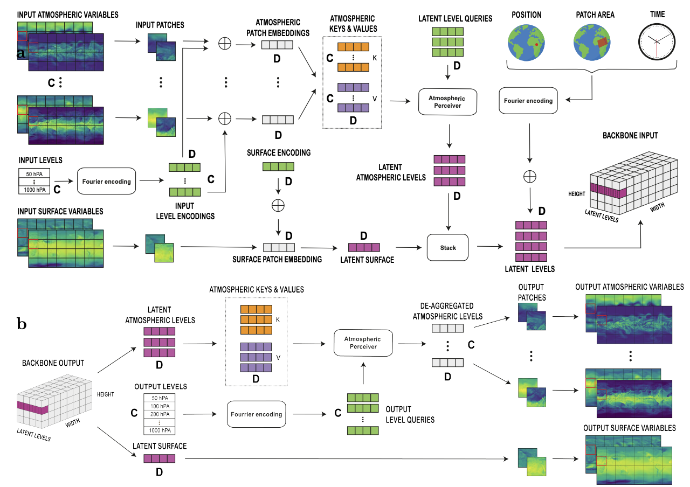

# Introduction

This repository contains a comprehensive implementation of the Aurora weather forecasting model with JAX/Flax, inspired by the original [Microsoft Aurora](https://github.com/microsoft/aurora) repository. Aurora is a state-of-the-art foundation model for Earth system forecasting that can predict atmospheric variables, air pollution, and ocean waves.

This implementation provides:
- **JAX/Flax-based training** with multi-GPU support using data parallelism
- **Clean, modular code structure** with comprehensive training utilities
- **Multiple training strategies** including standard training, long rollout training, and replay buffer training
- **ERA5 and HRES dataset support** with automated data downloading
- **Weight conversion utilities** to convert PyTorch weights to JAX format
- **Forward pass evaluation** capabilities for both ERA5 and HRES datasets



## Overview

Aurora is a foundation model for Earth system forecasting that can predict multiple atmospheric and oceanic variables. The model uses a transformer-based architecture with specialized encoders and decoders for different variable types (surface, atmospheric, and static variables).

This implementation focuses on:
- **Multi-step rollout training** following the Aurora paper methodology
- **LoRA (Low-Rank Adaptation) fine-tuning** for efficient parameter updates
- **Comprehensive evaluation metrics** including MAE and RMSE
- **Flexible training configurations** for different use cases

### Model Performance Comparisons

The following images show comparisons between Aurora predictions and ground truth for different variable types:

**Atmospheric Variables Comparison:**


**Surface Variables Comparison:**


For detailed quantitative analysis, please refer to the CSV file `output_images_and_results/aurora_rmse_mae - RMSE_MAE_errors_aurora.csv` which contains RMSE and MAE error metrics for different variables and time steps. **Note: These values are not normalized.**

## Code Structure

```
├── aurora/                          # Main Aurora model implementation
├── outputImagesAndResults/          # Results, images, and error analysis
│   ├── aurora-architecture.png
│   ├── compare_atm_truth_row.png
│   ├── compare_surf_truth_row.png
│   └── aurora_rmse_mae - RMSE_MAE_errors_aurora.csv
├── config.py                       # Training configuration and hyperparameters
├── train.py                        # Standard training script
├── LORA_train.py                   # Long rollout training with LoRA
├── trainReplayBuffer.py            # Training with replay buffer (WIP)
├── replay_buffer.py                # Replay buffer implementation
├── weight_conversion.py            # PyTorch to JAX weight conversion
├── download_ERA5.py                # ERA5 dataset download utility
├── download_HRES.py                # HRES dataset download utility
├── aurora_test_ERA5.py            # ERA5 forward pass evaluation
├── aurora_test_HRES.py            # HRES forward pass evaluation
├── checkpointEncoder/              # Pre-trained encoder weights
├── checkpointBackbone/             # Pre-trained backbone weights
├── checkpointDecoder/              # Pre-trained decoder weights
├── dataset/                        # Dataset storage directory
└── hresDataset/                    # HRES dataset storage
```

### Untracked Files

The following files are not tracked in the repository but should be present:

- **Static data file**: Should be placed at the path specified in `config.py` (currently `/home1/a/akaush/aurora/datasetEnviousScratch/static.nc`)
- **ERA5/HRES datasets**: Will be downloaded automatically using the provided scripts
- **Model checkpoints**: Should be downloaded from the Hugging Face repository below

## Model Weights Download

Download the pre-trained JAX model weights from this Hugging Face repository:

**[Download Aurora JAX Weights](https://huggingface.co/akshatkaush/aurora-small-jax/tree/main)**

The repository contains:
- `checkpointEncoder/` - Encoder weights in JAX PyTree format
- `checkpointBackbone/` - Backbone weights in JAX PyTree format  
- `checkpointDecoder/` - Decoder weights in JAX PyTree format

**Note**: These weights were converted in a single GPU environment. You may need to handle sharding issues if using multiple GPUs. The weights are provided as JAX PyTrees and may require adjustment for your specific multi-GPU setup.

## Dependencies Setup

Install the required dependencies:

```bash
# Install JAX with GPU support
pip install "jax[cuda]" -f https://storage.googleapis.com/jax-releases/jax_cuda_releases.html

# Install core dependencies
pip install flax optax orbax-checkpoint

# Install data handling dependencies
pip install torch torchvision
pip install xarray zarr netcdf4
pip install cdsapi  # For ERA5 downloads
pip install weatherbench2  # For HRES downloads

# Install visualization and logging
pip install matplotlib wandb
pip install numpy pandas

# Install the Aurora package
pip install microsoft-aurora
```

## Weight Conversion

The `weight_conversion.py` file provides utilities to convert pre-trained PyTorch Aurora weights to JAX format. This script:

- Loads PyTorch checkpoints from the original Aurora implementation
- Converts parameter names and structures to match JAX/Flax conventions
- Handles device placement and dtype conversions
- Saves the converted weights in JAX PyTree format

Usage:
```python
python weight_conversion.py --pytorch_ckpt_path /path/to/pytorch/checkpoint --output_path /path/to/jax/checkpoint
```

The conversion process ensures compatibility between the original PyTorch implementation and this JAX-based version.

## Forward Pass Evaluation

### ERA5 Dataset

**Download ERA5 Data:**
```bash
python download_ERA5.py
```

This script uses the CDS (Climate Data Store) API to download ERA5 reanalysis data. You'll need to:
1. Register at the [Copernicus Climate Data Store](https://cds.climate.copernicus.eu/)
2. Install your API key as described in the CDS documentation

**Run Forward Pass:**
```bash
python aurora_test_ERA5.py
```

This script performs forward pass evaluation on ERA5 data and generates prediction visualizations.

### HRES Dataset

**Download HRES Data:**
```bash
python download_HRES.py
```

This script uses WeatherBench2 to download high-resolution ECMWF forecasts. HRES data provides higher spatial resolution compared to ERA5.

**Run Forward Pass:**
```bash
python aurora_test_HRES.py
```

**Note**: ERA5 can also be downloaded using WeatherBench2 as an alternative to the CDS API. Both methods are supported for flexibility.

## Training

### Standard Training

Start fine-tuning using the `train.py` script:

```bash
python train.py \
    --batch_size 2 \
    --learning_rate 5e-5 \
    --epochs 20 \
    --rollout_steps 4 \
    --ckpt_encoder /path/to/checkpointEncoder \
    --ckpt_backbone /path/to/checkpointBackbone \
    --ckpt_decoder /path/to/checkpointDecoder
```

#### Training Arguments

- `--batch_size`: Batch size for training (default: 1)
- `--learning_rate`: Learning rate for optimizer (default: 5e-5)
- `--warmup_steps`: Number of warmup steps for learning rate schedule (default: 1000)
- `--epochs`: Number of training epochs (default: 20)
- `--rollout_steps`: Number of rollout prediction steps (default: 1)
- `--history_time_dim`: Number of historical time steps (default: 2)
- `--average_rollout_loss`: Whether to average loss across rollout steps (default: True)

#### Multi-Step Rollout Logic

The training implements multi-step rollout following the Aurora paper:

1. **Input Preparation**: Take initial atmospheric and surface conditions
2. **Rollout Prediction**: Generate predictions for multiple time steps ahead
3. **Loss Calculation**: 
   - If `average_rollout_loss=True`: Average MAE loss across all rollout steps
   - If `average_rollout_loss=False`: Use only the last rollout step for loss
4. **Gradient Update**: Update model parameters based on computed gradients

This approach helps the model learn long-term dependencies and improve forecast accuracy over extended time horizons.

#### Configuration

The `config.py` file contains important training parameters:

```python
# Loss function weights for different variables
surf_weights = {"2t": 3.5, "10u": 0.77, "10v": 0.66, "msl": 1.6}
atmos_weights = {"z": 3.5, "q": 0.8, "t": 1.7, "u": 0.87, "v": 0.6}

# Training hyperparameters
gamma = 1.0          # Loss scaling parameter
alpha = 1.0 / 4      # Atmospheric loss weight
beta = 1.0           # Surface loss weight
weight_decay = 5e-6  # L2 regularization

# Replay buffer configuration
REPLAY_BUFFER_CAPACITY = 200
DATASET_SAMPLING_PERIOD = 10
```

### Long Rollout Training

The `LORA_train.py` script provides advanced training with LoRA (Low-Rank Adaptation):

```bash
python LORA_train.py \
    --batch_size 1 \
    --learning_rate 5e-5 \
    --lora_learning_rate 1e-4 \
    --rollout_steps 8 \
    --freeze_base \
    --epochs 50
```

#### Key Features:

1. **LoRA Fine-tuning**: Freezes base model parameters and only trains low-rank adaptation matrices
2. **Longer Rollouts**: Supports extended rollout sequences (8+ steps)
3. **Parameter Efficiency**: Significantly reduces the number of trainable parameters
4. **Gradient Stopping**: Uses stop-gradient techniques to prevent vanishing gradients in long rollouts

#### LoRA Benefits:

- **Memory Efficient**: Only stores gradients for LoRA parameters
- **Faster Training**: Fewer parameters to update per step
- **Stable Training**: Avoids catastrophic forgetting of pre-trained knowledge
- **Better Generalization**: Maintains pre-trained model performance while adapting to new data

The script automatically separates LoRA and base parameters, applies different learning rates, and manages gradient flow through the long rollout sequences.

### Multi-GPU Training

The `train_multi_gpu.py` script provides scalable multi-GPU training using JAX's data parallelism:

```bash
python train_multi_gpu.py \
    --total_batch_size 8 \
    --learning_rate 5e-5 \
    --rollout_steps 4 \
    --epochs 30
```

#### Key Features:

- **Data Parallelism**: Model replicated on each GPU, data distributed across GPUs
- **Automatic Scaling**: Works with any number of available GPUs
- **Smart Batch Distribution**: Automatically distributes `total_batch_size` evenly across GPUs
- **Memory Optimization**: Configures XLA for stable multi-GPU operation (80% memory usage)

#### Training Arguments:

- `--total_batch_size`: Total batch size distributed across all GPUs (default: 2)
- `--gradient_accumulation_steps`: Accumulate gradients for larger effective batch sizes (default: 1)
- All standard arguments from `train.py` are supported

The implementation follows Aurora paper's approach with model replication and gradient synchronization across GPUs. Each GPU processes different samples while maintaining identical parameters, providing linear speedup with GPU count.

## WIP (Work in Progress)

### Replay Buffer Training

The repository includes experimental replay buffer training functionality:

#### `replay_buffer.py`

Implements a replay buffer for storing and sampling training batches:

```python
class ReplayBuffer:
    def __init__(self, capacity: int, seed: int = 0)
    def add(self, batch: Batch)           # Add batch to buffer
    def sample(self) -> Batch             # Sample random batch
    def extend(self, batches: List[Batch]) # Add multiple batches
    def clear(self)                       # Clear buffer
```

**Key Features:**
- **Fixed Capacity**: Maintains a maximum number of stored batches
- **CPU Storage**: Stores batches on CPU to save GPU memory
- **GPU Sampling**: Moves sampled batches to GPU for training
- **Random Sampling**: Provides uniform sampling from stored experiences

#### `trainReplayBuffer.py`

Experimental training script using replay buffer methodology:

```bash
python trainReplayBuffer.py \
    --batch_size 1 \
    --rollout_steps 4 \
    --freeze_base \
    --lora_learning_rate 1e-4
```

**Replay Buffer Training Logic:**

1. **Buffer Population**: Fill replay buffer with initial rollout predictions
2. **Mixed Training**: 
   - Sample batches from replay buffer for gradient updates
   - Generate fresh predictions to add to buffer
   - Balance between replay experience and new experience
3. **Experience Diversity**: Maintains diverse training examples to prevent overfitting
4. **Stable Learning**: Reduces correlation between consecutive training samples

**Current Status**: This is experimental code under active development. The replay buffer approach aims to improve training stability and sample efficiency for long rollout sequences.

**Potential Benefits:**
- Better sample utilization
- Improved gradient diversity  
- Reduced training instability
- More efficient long rollout training

**Note**: This feature is still being developed and may require additional tuning for optimal performance.

## Citation

If you use this code in your research, please cite:

```bibtex
@software{Kaushal_Microsoft_s_Aurora_in_2025,
author = {Kaushal, Akshat and Perdikaris, Paris},
doi = {10.5281/zenodo.16936899},
license = {MIT},
month = jul,
title = {{Microsoft's Aurora in JAX}},
url = {https://github.com/akshatkaush/aurora-jax},
version = {1.0.0},
year = {2025}
}